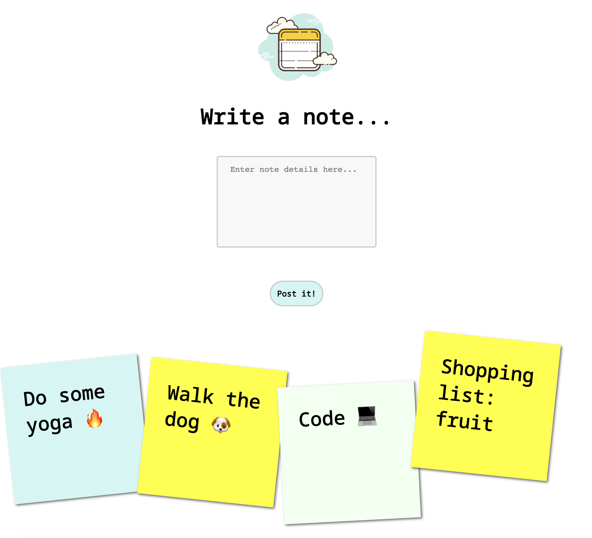
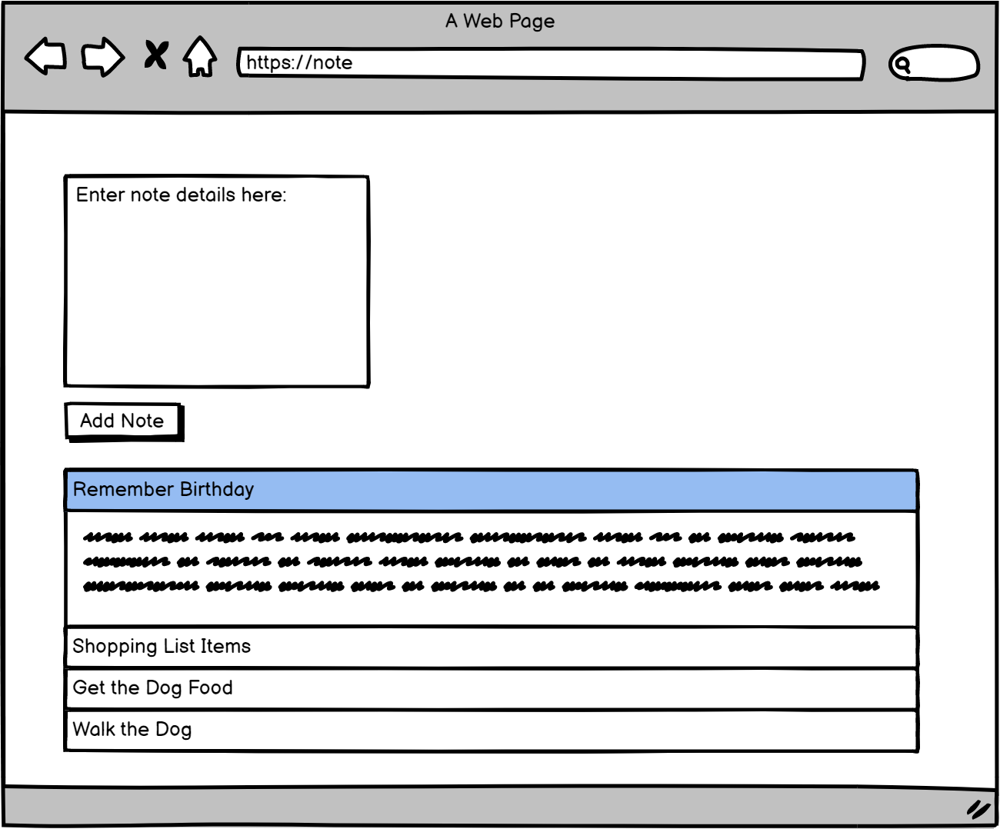

# Notes app: Post It

##### A frontend single-page app to write and store notes, connected to an emoji API, with a custom-built testing framework.

##### Built during week 7 of Makers Academy in a team of three after learning JavaScript for a week.

### [View the app on GitHub.io](https://lildann.github.io/notes_app/)





## User stories

```
As a programmer
I can create a new note
So I can record something I need to remember
```
```
As a programmer
I can see the full text of an individual note on its own page
So I can see all the information in the note
```
```
As a programmer
I can see a list of my notes, where each note is abbreviated to the first 20 characters
So I can find the one I want
```
```
As a programmer
I can use shortcodes like `:fire:` that get converted into emojis like 🔥
So I can record notes with fun little pictures
```

## Set up

`Node` and `npm` installed.

```
npm install http-server --save
node node_modules/http-server/bin/http-server
```

To run the code

```
npm install http-server --save-dev
```
